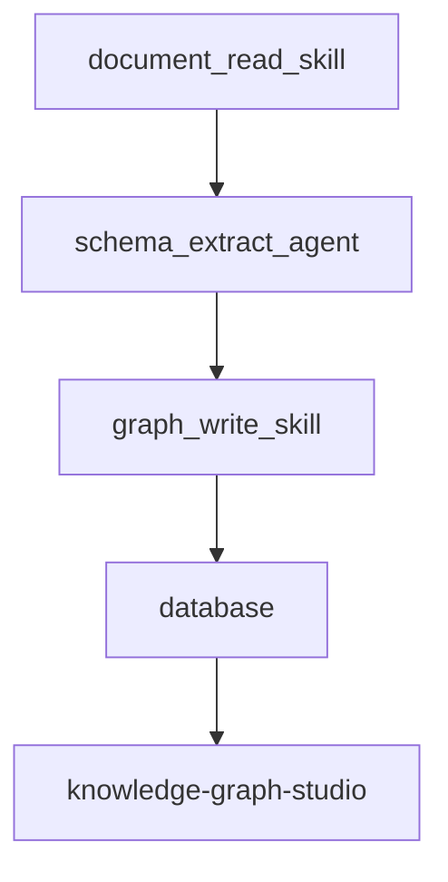

# Agent + Skills 知识图谱框架

## 1. 最新需求结论

和领导对齐后的方向，已经比之前更收敛了。

当前核心结论：

1. 实体之间不要求强行建立复杂关系，关系不是第一优先级。
2. 最重要的是把 `schema` 设计好，只允许 schema 中定义过的实体类型和属性。
3. 一个知识库对应一个图谱，知识库类型相对固定。
4. 不同知识库的词表和实体类型本来就不同，可以通过 schema 固化。
5. 系统的首要价值不是“自动发现一切新知识”，而是“帮助新员工围绕一个实体快速学习更多内容”。
6. 前端即使支持关系展示，也应把关系作为可选显示层，而不是默认主视图。

所以当前产品目标不是做开放世界知识发现，而是做：

`Schema 约束下的知识抽取与学习展示系统`

## 2. 当前产品目标

先做最小可行版本：

- 先跑通单文档
- 先支持 Word 报告
- 先整篇全局分析
- 先按 schema 抽实体和属性
- 先把原文出处挂上去
- 先让 `knowledge-graph-studio` 能展示“一个实体的全部学习信息”

暂不进入第一阶段的内容：

- 复杂实体关系网络
- 多项目统一大图谱
- 剖面图、附图、照片深度挂接
- 阶段演化建模
- 审核后台和复杂工作流

一句话：

`先把一篇报告稳定抽成一组高质量、强 schema 约束的学习实体卡片。`

## 3. 核心原则

### 3.1 Schema 第一

不是先让模型自由抽取，再事后清洗。

而是先定义知识库 schema，再让模型只能在这个范围里抽取。

例如：

- 地质可研报告库
- 经验库
- 规范库

每个库都应有自己的 schema。

### 3.2 一个知识库一个图谱

当前不做跨知识库统一大图谱。

例如：

- 庄河地质可研库 -> 庄河地质图谱
- 经验案例库 -> 经验图谱
- 规范库 -> 规范图谱

每个图谱内部结构稳定、实体类型稳定、抽取目标稳定。

### 3.3 关系不是第一优先级

关系可以有，但不强求。

当前最重要的是：

- 实体抽得准
- 属性抽得准
- 原文出处挂得准
- 用户点开实体时，能看到足够多的学习信息

所以第一阶段可以接受：

- 少关系
- 弱关系
- 甚至某些知识库先只有实体和属性

并且前端层面也要配合这个原则：

- 默认可以弱化关系展示
- 关系只作为辅助理解信息存在
- 用户可以主动打开或关闭关系层

### 3.4 全局分析路线不变

这一点不变。

当前仍然坚持：

`整篇文档全局分析 -> 在 schema 约束下抽取 -> 回链原文证据 -> 写入数据库`

而不是：

`先切碎 -> 再分别抽 -> 最后拼图`

## 4. 知识库类型与 Schema

当前可以把知识库先分成几类，每类维护一份固定 schema。

### 4.1 地质可研报告库

典型实体类型示例：

- 项目
- 工程部位
- 地质单元
- 岩性
- 构造
- 水文地质对象
- 工程地质问题
- 风险
- 试验
- 参数
- 结论
- 建议

### 4.2 经验库

典型实体类型示例：

- 问题类型
- 案例
- 触发条件
- 处理措施
- 经验结论
- 注意事项

### 4.3 规范库

典型实体类型示例：

- 规范
- 条文
- 术语
- 指标
- 适用条件
- 限值
- 说明

## 5. Schema 应该包含什么

每个知识库 schema 至少应定义：

- 允许的实体类型
- 每类实体允许的属性
- 每类实体的别名规则
- 每类实体的展示字段
- 可选关系类型
- 是否允许出现“候选实体待审核”

建议 schema 结构示意：

```json
{
  "knowledge_base_type": "geology_report",
  "entity_types": [
    {
      "type": "rock_type",
      "label": "岩性",
      "aliases": ["岩石类型", "岩石名称"],
      "attributes": ["description", "engineering_significance", "evidence_summary"]
    },
    {
      "type": "engineering_issue",
      "label": "工程地质问题",
      "attributes": ["description", "risk_level", "affected_scope", "evaluation"]
    }
  ],
  "relation_types": [
    "affects",
    "located_in",
    "has_property"
  ]
}
```

注意：

- 第一阶段 `relation_types` 可以很少，甚至某些库先留空。
- 真正重要的是 `entity_types + attributes`。

## 6. 当前系统架构

当前建议保持极简，只保留 2-3 个 skills / agent。



## 7. Skills / Agent 设计

### 7.1 `document_read_skill`

职责：

- 读取 Word 文档
- 提取全文文本
- 提取章节结构
- 提取表格内容
- 给段落编号

输出：

```json
{
  "document": {},
  "sections": [],
  "paragraphs": [],
  "tables": []
}
```

### 7.2 `schema_extract_agent`

职责：

- 整篇通读文档
- 读取当前知识库 schema
- 只在 schema 允许的类型中抽实体
- 只在 schema 允许的属性中填属性
- 可选地产出少量关系
- 输出候选实体的原文出处

这是当前系统最核心的一层。

### 7.3 `graph_write_skill`

职责：

- 规范化输出结构
- 去掉不在 schema 中的实体
- 合并同文档中的重复实体
- 把实体、属性、出处写入数据库
- 为前端生成图谱视图数据

## 8. 当前最合理的数据流

### Step 1. 读取整篇文档

`document_read_skill` 输出：

- 文档标题
- 文档全文
- 章节列表
- 段落编号
- 表格编号

### Step 2. 读取知识库 schema

根据当前知识库类型，加载对应 schema。

例如：

- `geology_report_schema.json`
- `experience_schema.json`
- `spec_schema.json`

### Step 3. 整篇全局分析

把整篇文档和 schema 一起交给大模型。

模型目标不是“自由发现所有东西”，而是：

- 从全文中找出 schema 允许的实体
- 为每个实体补充属性
- 记录实体的证据出处
- 可选地产出少量辅助关系

### Step 4. 结构化落库

把结果写入数据库。

第一阶段优先写：

- 实体
- 实体属性
- 实体原文出处
- 实体所属章节

### Step 5. 前端展示

`knowledge-graph-studio` 读取数据库，展示：

- 图谱节点
- 实体详情
- 原文出处
- 相关章节
- 相关文档信息

## 9. 章节不是实体

这个原则仍然保留，而且要写死。

### 章节容器示例

- `地震带划分及地震记录`
- `区域地质概况`
- `库区工程地质问题及评价`

这些是章节，不是实体。

### 真正实体示例

- `郯庐地震带`
- `片麻岩`
- `上水库`
- `地下厂房`
- `水库渗漏`
- `外水压力`

章节的作用是：

- 定位
- 分类
- 聚焦
- 证据归属

不是图谱的主角。

## 10. 当前数据模型

第一阶段建议只保留最小数据模型：

- `knowledge_bases`
- `documents`
- `sections`
- `entities`
- `entity_attributes`
- `entity_mentions`
- `evidence`

如果你想保留关系，也可以加：

- `relations`

但它不是第一优先级。

### 10.1 `entities`

- `id`
- `knowledge_base_id`
- `document_id`
- `name`
- `entity_type`
- `summary`
- `canonical_name`

### 10.2 `entity_attributes`

- `id`
- `entity_id`
- `attribute_name`
- `attribute_value`
- `confidence`

### 10.3 `entity_mentions`

- `id`
- `entity_id`
- `document_id`
- `section_id`
- `paragraph_id`
- `surface_form`

### 10.4 `evidence`

- `id`
- `owner_type`
- `owner_id`
- `document_id`
- `section_id`
- `paragraph_id`
- `quote`

### 10.5 `relations`（可选）

- `id`
- `source_entity_id`
- `target_entity_id`
- `relation_type`
- `summary`

## 11. 当前前端展示重点

前端现在的重点不是“复杂关系网络炫技”，而是“实体学习卡片”。

用户点开一个实体时，右侧应优先看到：

- 实体名称
- 实体类型
- 实体摘要
- 所有已抽取属性
- 原文出处在哪些章节
- 支撑这个实体的关键原文摘录
- 该实体在当前知识库中还有哪些补充信息

也就是说，前端核心体验更像：

`从一个实体点进去，逐层展开学习材料`

而不是：

`先看一张关系特别复杂的大网图`

### 11.1 关系显示开关

前端应支持一个简单开关：

- 打开：显示当前知识库中已经抽取出的少量关系
- 关闭：隐藏关系，只保留实体节点和学习信息

这意味着：

- 关系不是必须存在
- 即使关系存在，也不应该强制干扰学习视图
- `knowledge-graph-studio` 可以支持“实体视图”和“实体 + 关系视图”两种模式

## 12. 当前关系策略

第一阶段对关系的策略改成：

- 关系可以抽，但不是硬指标
- 关系只保留少量稳定、可控的类型
- 如果某个知识库不适合关系抽取，可以先只做实体和属性
- 如果关系存在，前端默认也应允许用户关闭它们

第一阶段允许的关系类型建议只保留：

- `located_in`
- `part_of`
- `has_property`
- `affects`
- `related_to`

如果抽不稳，就先不展示关系。

## 13. 当前最重要的成功标准

不是“图看起来有多炫”，而是：

1. schema 是否设计合理
2. 抽出的实体是否都在 schema 允许范围内
3. 实体属性是否丰富
4. 原文出处是否能准确回链
5. 新员工点开一个实体后，是否真的能学到东西
6. 即使关闭关系显示，图谱是否仍然具备学习价值

## 14. 开发顺序

当前按这个顺序推进：

1. 先定义知识库类型和 schema
2. 完善 `document_read_skill`
3. 做 `schema_extract_agent`
4. 做实体属性和证据落库
5. 让 `knowledge-graph-studio` 先展示实体学习视图
6. 最后再决定关系要不要增强

## 15. 当前原则

`强 schema，弱关系，重属性，重出处，重学习价值。`
